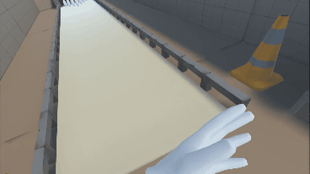
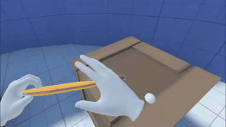
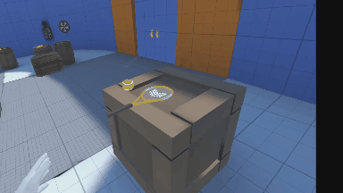
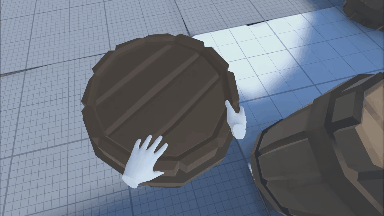

## Introduction

This project aims to develop a virtual reality application and implement some
techniques studied during the course. We implemented this application using Oculus Quest. To connect the Oculus Quest with Unity, we had to use the oculus VR API, which is responsible for communicating with the headset and the controllers.
The application consists of a series of mini-games that take advantage of the interaction and navigation mechanics implemented for this project. Precisely, it consists of the main room and four mini-games.

## Virtual Environment

The environment consists of five rooms:

- **Hub**: The room has some interactive objects that the player can play with (for example, a frisbee, a hammer, a tennis racquet, and a tennis ball...).

- **Bowling room**: This game is a bowling alley, users can get a bowling ball and throw it to get as many pins as possible.

- **Factory room**: This game requires the player to use both navigation and selection techniques to classify different types of objects that came out of a moving bell before they fell on the floor.

- **Golf room**: This room represents a mini golf level in which the player has to put the ball into the hole doing minimum touches.

- **Meteorite room**: The objective of this game is to cut the coming meteorites before they touch the floor.

## Selection and manipulation

In the application, we have two selection methods:

- **Hand selection**: When the hand is near an object, the object is highlighted, and the user can press the lateral trigger button to grab the object.

- **Ray-based selection**: When the object is too far from the player, it is possible to press the main trigger of the controller to throw a ray to select objects, the objects will also be highlighted and can be grabbed by pressing the lateral trigger button.

Also, the application has an isomorph manipulation technique that allows interaction with the environment. Once an object is selected and grabbed, the object will follow the controller's movements while pressing the lateral trigger button.

One way to implement object manipulation is to parent them to the controller, this way, they will follow its position and rotation. However, since manipulating objects is an essential part of the application, we decided to implement a physically based grabbing technique that depends on the weight and center of mass of grasped objects to increase the feeling of immersion.

This technique is based on physics joints and springs. When an object is grasped, the object is attached to the virtual hand, and the center of mass is computed based on the colliders of the object.

This physically based grabbing allows different behaviors for objects with different weights and distributions of mass. For example, a heavy hammer grabbed from the handle with one hand will tend to fall due to gravity, while using two hands will improve the control of the object.

Also, to grab a large set of objects without doing a grab hand animation for each object, we decided to implement a procedural grabbing technique in which the grabbing poses depend on the object colliders.

## Navigation

There are three types of movements in the application:

- **Physical movement**: Since we are using Oculus Quest, this type of movement
  comes by default, and it is the mapping of the real movements of the player in the
  virtual environment.

- **Joystick**: To allow the player to explore and move to the different rooms, it is possible to move around using the joystick provided in the right controller. This
  movement is helpful when the player is exploring or has to do small movements because it is fast, and it is easy to change the direction of the movement at any moment.

- **Teleport**: Although the joystick movement allows movements all over the
  environment, using this method too much can produce motion sickness and be too slow in large environments. Teleporting enable the player to move instantaneously to the selected place. To use the teleport, press the joystick in the
  right controller.

- **Smooth Teleport**: Teleport can cause spatial disorientation because the player changes the position instantaneously, to reduce this, we implemented a smooth teleport. The idea is to move the player from their position to the final position with a smooth movement forming a parabola, so the player can see where it moves.
